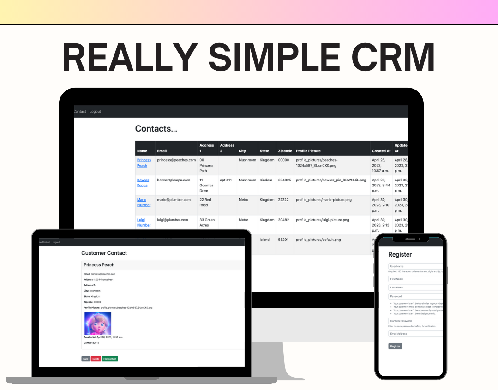

# ReallySimpleCRM
This application is a web-based CRM (Customer Relationship Management) system built using Django. It is designed to help businesses manage their customer contacts effectively and streamline their communication and sales processes. With the application, you can easily store and organize customer information, track interactions, and stay connected with your clients.

## Features
- User authentication: Users can register, log in, and manage their accounts.

- Contact management: Create, view, edit, and delete contact records.

- Profile pictures: Upload and display profile pictures for each contact.

- User-friendly interface: Utilizes a clean and intuitive interface for easy navigation.

## Getting Started
To run ReallySimpleCRM locally on your machine, follow these steps:

### Prerequisites
Python 3.9 or higher   
Django 3.2 or higher  

### Installation  
1. Clone the repository:  
`git clone https://github.com/your-username/reallysimplecrm.git`

2. Navigate to the project directory:  
`cd reallysimplecrm
`

3. Create a virtual environment:  
On Windows:  
`python -m venv venv
`  
On macOS/Linux:  
`python3 -m venv venv`  

4. Activate the virtual environment:  
On Windows (Command Prompt):  
`venv\Scripts\activate
`  
On macOS/Linux:  
`source venv/bin/activate
`  

5. Install project dependencies:  
`pip install -r requirements.txt`  

### Configuration
1. Create a .env file in the project directory.

2. Define the necessary environment variables in the `.env` file, such as:  
`DEBUG=True`   
`SECRET_KEY=your_secret_key_here`  
`DATABASE_URL=your_database_url_here`  
Modify the values according to your specific configuration.  

3. Configure the database settings in `dcrm/settings.py` to match your local environment. 

### Database Setup
1. Apply database migrations:  
`python manage.py migrate
`  
2. Create a superuser (admin) account:  
`python manage.py createsuperuser
`  
Follow the prompts to set a username and password for the admin account.  

### Run the Application
1. Start the development server:  
`python manage.py runserver
`  
2. Access the application in your web browser at:  
`http://localhost:8000
`  
3. To access the admin interface, go to:  
`http://localhost:8000/admin
`  
Log in using the superuser account created earlier.  

## Usage
Once you have set up the ReallySimpleCRM application on your local machine, you can perform various actions to manage your contacts. Here are the key actions and instructions on how to perform them:  

### Creating a New Contact
To create a new contact, follow these steps:

1. Launch the application by running the development server.  
`python manage.py runserver
`  
2. Open your web browser and navigate to http://localhost:8000/ to access the application.

3. Log in using your credentials or register a new account if you don't have one.

4. On the home page, click on the "New Contact" button.

5. Fill in the required information for the contact, such as their name, email, address, and profile picture (optional).

6. Click the "New Contact" button to save the new contact.  

### Updating an Existing Contact
To update an existing contact, follow these steps:

1. Log in to the application using your credentials.

2. Navigate to the contact detail page for the contact you want to update by clicking on a contact's name.

3. Click on the "Edit Contact" button.

4. Modify the desired fields, such as name, email, or address. You can also choose a new profile picture if needed.

5. Click the "Edit Contact" button to save the changes.  

### Viewing the Contact List
To view your list of contacts, follow these steps:

1. Log in to the application using your credentials.

2. On the home page, you will see a table displaying your contacts.

3. Each row represents a contact and shows their name, email, address, and other relevant information.

4. Click on a contact's name to view their detailed information on a separate page.

## Acknowledgements

This project was built with the help of the following external libraries and frameworks:

- [Django: Documentation](https://docs.djangoproject.com/en/4.2/)  
- [Bootstrap: Documentation](https://getbootstrap.com/docs/5.2/getting-started/introduction/)  

